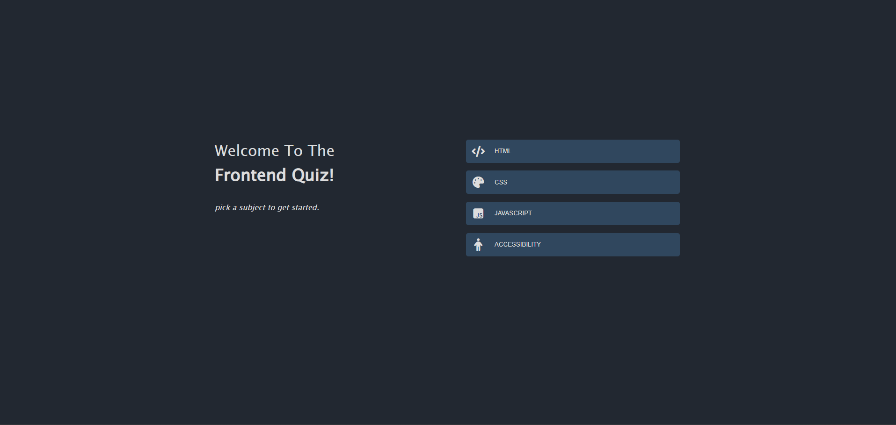
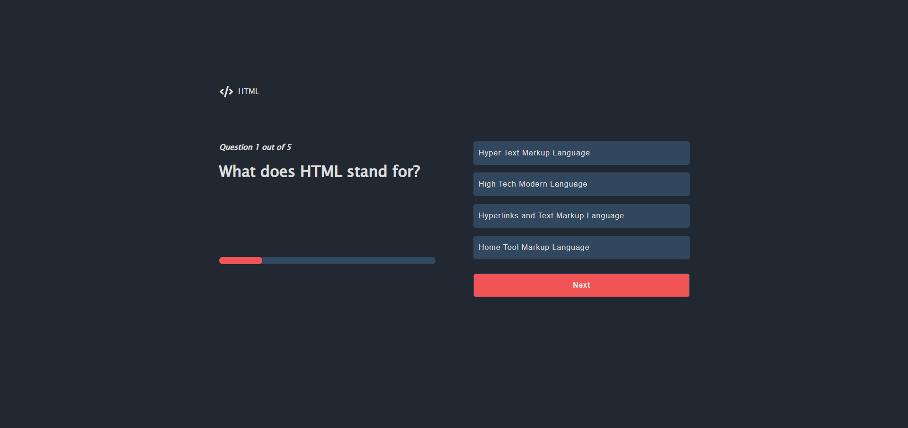
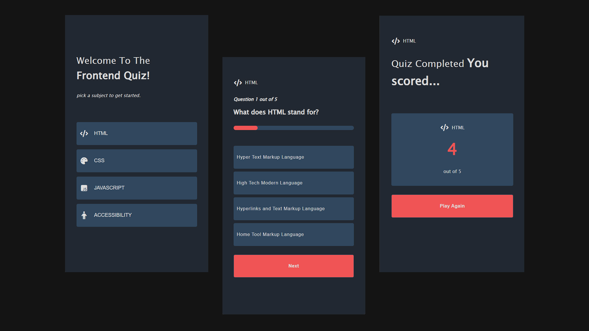

# frontend-quiz

A lightweight, interactive quiz application built using HTML, CSS, and Vanilla JavaScript. Users can select from multiple categories (e.g., HTML, CSS, JAVASCRIPT, ACCESSIBILITY) and test their knowledge through a clean and responsive interface.

## ✨ Features
- Category-based quiz selection
- Dynamic question rendering
- Answer validation with score tracking
- Clean and accessible UI
- Responsive layout for all screen sizes

## 🚀 Tech Stack
- HTML5 for semantic structure
- CSS3 (Flexbox/Grid, media queries) for responsive design
- JavaScript (ES6+) for quiz logic and interactivity

## 📸 Preview
### desktop view - main page

### desktop view - load quiz

### desktop view - show score

### mobile view
